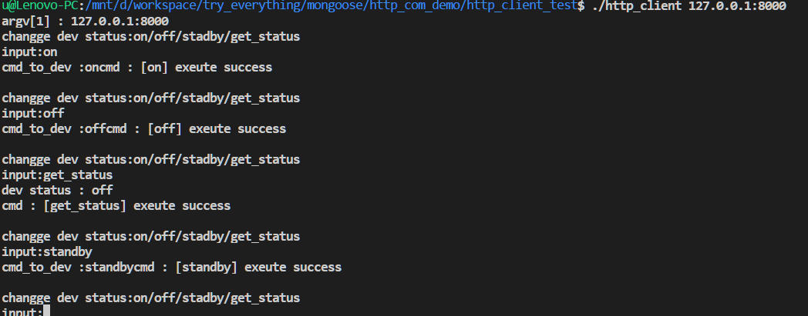
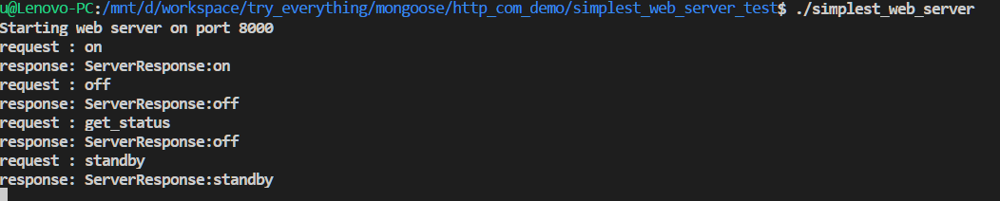

# http client & http server demo

## 实验环境
*	基于mongoose的http环境进行实验，使用的mongoose源码见https://github.com/cesanta/mongoose.git
*	开发环境ubuntu 1604
*	编译工具gcc
*	代码管理工具 Makefile
## 实验内容
*	基于mongoose的http实现http client和http server的简单交互，http client向http server发送request，http server根据相应的request进行response
*	http client发送的cmd有get_status,on,off,standby等
#demo 编译
*	http client编译
	* 进入http_client_test
	* make -- 将会编译出http_client
	* make clean -- 清理编译的文件
*	http server编译
	*	进入simplest_web_server_test
	*	make -- 将会编译出simplest_web_server
	*	make clean -- 清理编译的文件
#demo运行
*	先在simplest_web_server_test目录下
	*	./simplest_web_server开启 http server
*	然后进入http_client_test目录下
	*	./http_client localhost:8000 或者 ./http_client 127.0.0.1:8000
	*	之后根据指令输入 on,off,stadby或者get_status等cmd与server进行交互
	*	

## 实验结果截图
*	http client结果截图
*	
*	http server结果截图
*	
